# KVMem QW3

**CUDA-native Qwen inference with tiered KV memory for long-running agents.**

**Paper:** TBD · **Demo video:** TBD

<!-- Replace the two TBD values with the final paper and video links. -->

KVMem QW3 is a single-GPU inference and memory runtime for the text path of
Qwen `qwen35` hybrid models. Its core capability, **KVMem**, retains previously
computed attention KV blocks across GPU memory, host RAM, and optional NVMe,
then retrieves a bounded working set for each new query.

The goal is to let an agent keep a large accumulated history without repeatedly
compacting that history into text or attending densely to every past token on
every answer.

> [!IMPORTANT]
> **KVMem, Q8_0, and NVFP4 are core product capabilities.** “Core” describes
> product role, not public validation status. All three have real-model internal
> evidence; no runtime profile will be called **Release-tested** until it is
> reproduced from the public release commit with pinned inputs and a published
> result artifact.

> [!TIP]
> **Planned launch demo:** generate a 107K-token incident ledger on camera,
> place an unseen rollback code in the middle, and recover it with a 32K-token
> GPU working set. The video will ship with the exact corpus, manifest, trace,
> and response so the result cannot be explained by model memorization.

## Why KVMem?

Long-running agents accumulate conversation, tool output, and workspace history.
Dense attention grows the active KV cache with that history; text compaction
discards detail; rebuilding a long prompt repeats expensive prefill work.

KVMem instead treats contextualized KV state as a tiered memory system:



The animation plays once and leaves a complete final frame. It is an
illustrative control-flow explanation, not performance evidence.

The model still generates locally in the QW3 CUDA runtime. KVMem is not an
external vector database or a RAG service. Three controls define its memory
shape:

- `--ctx`: maximum accumulated request or session capacity.
- `--kvmem-budget`: history selected into the active working set.
- `--kvmem-gen-budget`: space reserved for the new response.

When history exceeds the working-set budget, selection is lossy by design.
Retrieval method, block size, query quality, and budget can affect answer
quality.

## Current release boundary

| Profile | Product role | Implementation evidence | Public support state | Hardware boundary |
|---|---|---|---|---|
| Qwen3.6-27B Q8_0 + FP16 KV + KVMem `mean-k` | Core onboarding profile | Ready; real-model internal runs | Release candidate; public GGUF reproduction pending | Shown 128K template starts with a 48 GiB-class dedicated GPU; SM120 is the current reference |
| Qwen3.6-27B NVFP4 + FP8 KV + KVMem `mean-k` | Core memory-efficient profile | Ready; loader, kernels, generation, and real-model KVMem exercised internally | Release candidate; dependency lock and clean public rerun pending | NVIDIA SM120a only; physical 24 GiB support is not yet claimed |
| MTP, continuous batching, alternative scorers, frozen archives | Advanced Preview | Implemented and internally exercised | Outside the canonical first-user gate | Combination-specific constraints apply |
| Host build and unit tests | Contributor baseline | Clean build and tests reproduced | Does not validate model generation | Linux x86-64; no GPU required |

The terms are intentionally separate:

- **Core**: part of the primary product and first-release scope.
- **Internally validated**: real-model development runs exist.
- **Release-tested**: a public commit, immutable model/dependency manifest,
  recorded GPU/toolchain, exact commands, and published pass artifact exist.

NVFP4 is implementation-ready. What remains is public reproducibility
packaging—not the NVFP4 loader or kernel path itself. Until that packaging is
complete, the build interface below is for developers with the compatible
dependency bundle, not a self-contained install promise.

## Requirements and GPU target

- Linux x86-64 and a single NVIDIA GPU.
- CMake 3.18+ for `CMAKE_CUDA_ARCHITECTURES` and a C++17 compiler.
- A CUDA toolkit compatible with the selected GPU; the current SM120
  development environment uses CUDA 13.0.
- The Hugging Face `hf` CLI for the model download commands.
- Enough local disk for the model plus optional NVMe tier storage.
- Additional host RAM for the requested KVMem CPU tier.

Host-only builds support inspection and unit tests, but QW3 does not provide
CPU model generation.

Before downloading, note that the Q8_0 candidate alone is 28.6 GB. The 128K
KVMem command below is a high-memory reference template, not a minimum-VRAM
claim. Inspect the first visible GPU:

```bash
nvidia-smi --query-gpu=name,compute_cap,memory.total --format=csv,noheader
```

Select exactly one build target. Current candidate mappings are `8.0 → 80`,
`8.6 → 86`, `8.9 → 89`, `9.0 → 90`, and the RTX PRO 6000 Blackwell reference
`12.0 → 120a-real`. Only SM120 has current real-model release-candidate
evidence; the other Q8 targets remain pending public hardware gates.

## Quick start: Q8_0 KVMem

This is the default onboarding path because it uses in-tree CUDA kernels and
FP16 KV without FlashInfer.

### 1. Clone and download the model

```bash
git clone https://github.com/Di-Chai/qw3.git
cd qw3

export QW3_MODEL_ROOT="${PWD}/../qw3-models"
export QW3_Q8_REVISION=82d411acf4a06cfb8d9b073a5211bf410bfc29bf
export QW3_Q8_DIR="${QW3_MODEL_ROOT}/qwen36-q8"
mkdir -p "${QW3_Q8_DIR}"

hf download unsloth/Qwen3.6-27B-GGUF \
  Qwen3.6-27B-Q8_0.gguf \
  --revision "${QW3_Q8_REVISION}" \
  --local-dir "${QW3_Q8_DIR}"

export QW3_MODEL="${QW3_Q8_DIR}/Qwen3.6-27B-Q8_0.gguf"
export QW3_Q8_SHA256=f93f517f38e696d35a1a7df2c0e3155a64f4c4dcd662107a146ae263f7fb14ce
printf '%s  %s\n' "${QW3_Q8_SHA256}" "${QW3_MODEL}" | sha256sum -c -
```

The immutable candidate and Apache-2.0 model declaration are on the
[pinned model tree](https://huggingface.co/unsloth/Qwen3.6-27B-GGUF/tree/82d411acf4a06cfb8d9b073a5211bf410bfc29bf).
This public file is not byte-identical to the private GGUF used by earlier
internal runs, which is why the clean public reproduction remains a gate.

The final tagged README will also pin the QW3 tag and `hf` CLI version. This V1
draft precedes that tag.

### 2. Build for the GPU

Set the architecture reported above; this example is only for the current
RTX PRO 6000 Blackwell reference:

```bash
export QW3_CUDA_ARCH=120a-real

cmake -S . -B build-q8 \
  -DCMAKE_BUILD_TYPE=Release \
  -DQW3_BUILD_TESTS=OFF \
  -DQW3_ENABLE_CUDA=ON \
  -DCMAKE_CUDA_ARCHITECTURES="${QW3_CUDA_ARCH}"

cmake --build build-q8 -j

export QW3_BIN="${PWD}/build-q8/qw3"
export QW3_KV_DTYPE=fp16
./build-q8/qw3-inspect "${QW3_MODEL}"
```

If CMake cannot find `nvcc`, add the CUDA `bin` directory to `PATH` or set
`CUDACXX` before configuring.

### 3. Verify plain generation

This checks model loading and native generation before KVMem is introduced:

```bash
"${QW3_BIN}" \
  --model "${QW3_MODEL}" \
  --ctx 8192 \
  --kv-dtype "${QW3_KV_DTYPE}" \
  --mtp-chain 0 \
  --prefill-chunk 1024 \
  --temp 0 --top-p 1 --top-k 1 \
  -p "Explain virtual memory in one paragraph." \
  -n 256
```

### 4. Start the core KVMem service

Run this in terminal 1. It deliberately disables MTP and continuous batching
and uses serialized query-conditioned `mean-k` retrieval, a GPU retrieval
index, and a host KV tier:

```bash
QW3_KVMEM_TIER_TRACE=1 QW3_KVMEM_TRACE=1 \
"${QW3_BIN}" serve \
  --model "${QW3_MODEL}" \
  --host 127.0.0.1 --port 8080 \
  --ctx 131072 \
  --kv-dtype "${QW3_KV_DTYPE}" \
  --prefill-chunk 1024 \
  --mtp-chain 0 \
  --no-continuous-batching \
  --kvmem \
  --kvmem-block-tokens 128 \
  --kvmem-budget 32768 \
  --kvmem-prefill-budget 32768 \
  --kvmem-gen-budget 8192 \
  --kvmem-method retrieval \
  --kvmem-retrieval-method mean-k \
  --kvmem-query-conditioned \
  --kvmem-query-replay \
  --kvmem-update-mode step \
  --kvmem-index-placement gpu \
  --kvmem-gpu-memory-ratio 0.90 \
  --kvmem-cpu-gb 16 \
  2>&1 | tee /tmp/qw3-kvmem-server.log
```

`--kvmem-gpu-memory-ratio` limits total QW3 process GPU memory—including model
weights and scratch—not KV memory alone. The `0.90` value assumes a dedicated
GPU.

The built-in server has no authentication or TLS. Keep it on `127.0.0.1`, or
place it behind an authenticated TLS reverse proxy.

### 5. Prove that KVMem engaged

Run the following in terminal 2. It creates a history larger than the 32K
working-set budget, places a code outside the default sink/recent regions, and
asks for it through the final-user query span:

```bash
python3 - <<'PY'
import json
from urllib.request import Request, urlopen

BASE = "http://127.0.0.1:8080"
SECRET = "KVMEM-ALPHA-4937"

def post(path, body):
    req = Request(
        BASE + path,
        data=json.dumps(body).encode(),
        headers={"Content-Type": "application/json"},
        method="POST",
    )
    with urlopen(req, timeout=1200) as response:
        return json.load(response)

before = "\n".join(
    f"Record {i}: neutral notes about rivers, stones, and clouds."
    for i in range(3000)
)
after = "\n".join(
    f"Record {i + 3000}: neutral notes about forests, bridges, and rain."
    for i in range(3000)
)
history = before + f"\nThe exact deployment code is {SECRET}.\n" + after
count = post("/tokenize", {"content": history})["count"]
if not 32768 < count < 120000:
    raise SystemExit(f"unexpected history size: {count} tokens")

result = post("/v1/chat/completions", {
    "model": "qw3",
    "messages": [
        {"role": "user", "content": history},
        {"role": "assistant", "content": "I have stored the records."},
        {"role": "user", "content": "Reply with only the exact deployment code."},
    ],
    "temperature": 0,
    "top_p": 1,
    "top_k": 1,
    "max_tokens": 64,
    "enable_thinking": False,
})
answer = result["choices"][0]["message"]["content"]
print(f"history_tokens={count} answer={answer!r}")
print("quality_canary=" + ("PASS" if SECRET in answer else "MISS"))
PY

grep -E 'native kvmem query-replay \(plain\).*index_ready=1' \
  /tmp/qw3-kvmem-server.log
grep -E '\[kvmem-scorer\].*requested=mean-k used=mean-k fallback=0' \
  /tmp/qw3-kvmem-server.log
grep -E '\[kvmem-tier\] stage_out' /tmp/qw3-kvmem-server.log
```

HTTP/JSON success and all three trace checks are the runtime gate: they prove
query replay, non-fallback `mean-k`, and tier movement. `quality_canary=PASS`
is a retrieval-quality canary, not an installation gate while the public GGUF
is still awaiting its pinned release rerun. Once that rerun makes the canary
stable, it can become a hard quality check. A short chat request can verify HTTP
health, but cannot prove sparse retrieval or tier movement.

## Optional NVMe tier

NVMe is part of the KVMem storage design, but is not needed for the first gate.
Add the following to the service command after choosing a fast local path:

```text
--kvmem-nvme-dir /absolute/path/on/local/nvme/qw3-kvmem
--kvmem-nvme-gb 64
```

Without `--kvmem-raw-k-nvme`, immutable raw K remains in host RAM and NVMe
backs ordinary cold KV spill. A complete NVMe gate must force capacity beyond
the CPU tier and observe both `stage_out` and `stage_in_async_read`; merely
configuring a directory is not evidence that NVMe was used.

## Core NVFP4 profile

NVFP4 is the core memory-efficient weight path for NVIDIA SM120a. It loads an
HF `compressed-tensors` directory and uses FlashInfer/CUTLASS-backed NVFP4
kernels; it is not a generic Q4 GGUF path.

```bash
export QW3_NVFP4_REVISION=ccdaab7e68af2409599b8949a8f2685703c9bae5
export QW3_NVFP4_MODEL="${QW3_MODEL_ROOT}/qwen36-nvfp4"

hf download unsloth/Qwen3.6-27B-NVFP4 \
  --revision "${QW3_NVFP4_REVISION}" \
  --local-dir "${QW3_NVFP4_MODEL}"
```

The checkpoint revision and Apache-2.0 declaration are on the
[pinned NVFP4 tree](https://huggingface.co/unsloth/Qwen3.6-27B-NVFP4/tree/ccdaab7e68af2409599b8949a8f2685703c9bae5).
The release model manifest will add per-file hashes.

The public FlashInfer/CUTLASS lock is not final. Developers who already have a
compatible package-data bundle can exercise the current build interface:

```bash
export FLASHINFER_DATA=/absolute/path/to/compatible/flashinfer/data

test -f "${FLASHINFER_DATA}/include/flashinfer/gemm/fp4_gemm_cutlass_template_sm120.h"
test -f "${FLASHINFER_DATA}/cutlass/include/cutlass/arch/arch.h"
test -f "${FLASHINFER_DATA}/cutlass/tools/util/include/cutlass/util/command_line.h"

cmake -S . -B build-nvfp4 \
  -DCMAKE_BUILD_TYPE=Release \
  -DQW3_BUILD_TESTS=OFF \
  -DQW3_ENABLE_CUDA=ON \
  -DCMAKE_CUDA_ARCHITECTURES=120a-real \
  -DQW3_ENABLE_FLASHINFER=ON \
  -DQW3_FLASHINFER_INCLUDE_DIR="${FLASHINFER_DATA}/include" \
  -DQW3_FLASHINFER_CUTLASS_INCLUDE_DIR="${FLASHINFER_DATA}/cutlass/include"

cmake --build build-nvfp4 -j
./build-nvfp4/qw3 --model "${QW3_NVFP4_MODEL}" --native-plan

export QW3_BIN="${PWD}/build-nvfp4/qw3"
export QW3_MODEL="${QW3_NVFP4_MODEL}"
export QW3_KV_DTYPE=fp8
```

After setting those three variables, run the same plain-generation, KVMem
service, and above-budget gate used by Q8. Do not run `qw3-inspect` on an HF
directory; it is GGUF-only.

An internal one-token long-context probe observed about 22 GiB only with a
CPU-embedding configuration. That private observation is not a 24 GiB support
claim and does not validate the generic command above. `--cpu-embedding` is
therefore intentionally absent until its model-layout constraints have a
separate public profile.

## Capability matrix

| Area | Status |
|---|---|
| Serialized Q8_0/NVFP4 generation and query-conditioned KVMem `mean-k` | Core; public release gate pending |
| GPU → CPU → NVMe tiering | Core design; CPU gate shown, forced NVMe gate pending |
| `sub-block-mean-k`, `key-direction-fixed4`, `key-direction-adaptive`, CPU index placement | Advanced Preview |
| `per-token` retrieval | Advanced Preview; GPU index only |
| MTP, paged KV, continuous batching, and their KVMem combinations | Advanced Preview |
| Prefix reuse, session APIs, semantic groups, frozen archives | Advanced Preview |
| Qwen3.8 profile and additional physical GPU release matrices | Future profiles |
| CPU generation, AMD/ROCm, Metal | Unsupported |
| Generic Q4/Q6/Q8_K/IQ GGUF weights | Unsupported; native GGUF weights are Q8_0 plus F32 tensors |
| Multimodal image/video input | Out of scope; QW3 currently serves the text path |
| Frozen archive + continuous batching or non-FP8 archive KV | Unsupported |

The only public retrieval scorer values are `mean-k`, `per-token`,
`sub-block-mean-k`, `key-direction-fixed4`, and `key-direction-adaptive`.
Legacy names such as `mean_attention` and `content_mean` are invalid.

## Contributor checks

The host suite covers parsing, policy, protocol, and storage logic without
claiming native inference:

```bash
cmake -S . -B build-host -DCMAKE_BUILD_TYPE=Release
cmake --build build-host -j
ctest --test-dir build-host --output-on-failure
```

CUDA component tests are also insufficient on their own. Each Release-tested
profile requires a pinned real checkpoint, physical GPU, CLI/server smoke,
KVMem activity assertions, and a published result manifest.

## Documentation and license

- [Architecture](docs/architecture.md)
- [Harness compatibility](docs/harness_compatibility.md)
- [Claude Code integration](docs/claude_code.md)
- [Incremental KVMem sessions](docs/kvmem_incremental_session_api.md)
- [Semantic-group retrieval](docs/kvmem_semantic_group_retrieval.md)
- [Current release audit](docs/release_baseline.md)—this document must adopt
  the V1 status taxonomy before V1 replaces the root README.

QW3 source is licensed under the [Apache License 2.0](LICENSE). Third-party
components retain their licenses; see
[THIRD_PARTY_NOTICES.md](THIRD_PARTY_NOTICES.md). Model checkpoints are
distributed separately under their repository license terms.
